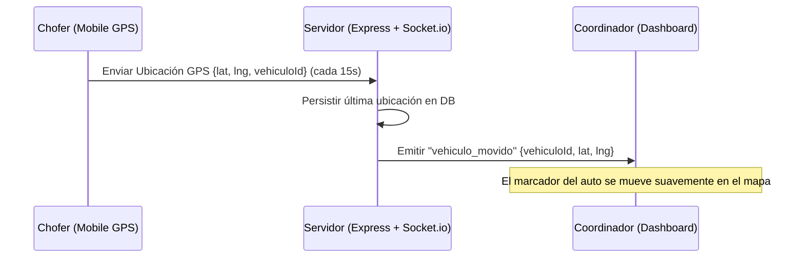

# 🗺️ Mapas en Tiempo Real y Arquitectura WebSockets

El panel del coordinador es el "cerebro" de una remisería. La capacidad de ver dónde están los autos en un mapa interactivo y recibir asignaciones de viajes al instante sin refrescar la pantalla es vital para el éxito comercial del sistema.

---

## 🗺️ 1. Resolviendo el Mapa Interactivo en Next.js (SSR Bypass)

El error `TypeError: render is not a function` ocurrió porque **Leaflet** accede directamente al objeto `window` del navegador para manipular el DOM. Dado que Next.js intenta pre-renderizar los componentes en el servidor (donde no existe el navegador ni el objeto `window`), Leaflet falla inmediatamente.

### La Solución Profesional: `next/dynamic`
Para resolver esto, debemos desactivar el Server-Side Rendering específicamente para el componente que renderiza el mapa, forzando a Next.js a cargarlo únicamente del lado del cliente (*Client-Side Rendering*).

#### Ejemplo de Implementación en la Página del Mapa:
```tsx
import dynamic from 'next/dynamic';

// Cargamos el componente de Leaflet de forma dinámica desactivando SSR
const MapWithNoSSR = dynamic(
  () => import('@/components/RealMapComponent'),
  { 
    ssr: false,
    loading: () => (
      <div className="w-full h-[500px] bg-gray-100 animate-pulse flex items-center justify-center rounded-lg">
        <span className="text-gray-500 font-medium">Cargando mapa interactivo...</span>
      </div>
    )
  }
);

export default function MapaPage() {
  return (
    <div className="w-full h-full">
      <MapWithNoSSR vehiculos={vehiculos} />
    </div>
  );
}
```

### Elección del Proveedor de Mapas:
1. **OpenStreetMap (OSM) + Leaflet (Gratuito)**:
   - **Costo**: $0 (Sin límites).
   - **Visualización**: Excelente para mostrar autos moviéndose en la ciudad de Buenos Aires o cualquier parte de Argentina.
   - **Rutas**: Requiere un servidor público como OSRM para dibujar las líneas del viaje (rastro del camino).
2. **Google Maps JavaScript API (Pago por Uso)**:
   - **Costo**: Gratuito hasta $200 USD mensuales, luego se cobra por consulta de mapa y geocodificación.
   - **Visualización**: La mejor calidad visual, Street View integrado y estimación de tráfico excelente.
   - **Recomendación**: Configurar el backend para aceptar una `GOOGLE_MAPS_API_KEY` por remisería, o usar una clave global administrada por ti (y cobrada en las suscripciones premium).

---

## ⚡ 2. Arquitectura en Tiempo Real con WebSockets (Socket.io)

Para que el mapa y los listados de viajes se actualicen en tiempo real sin saturar el servidor con peticiones HTTP repetitivas (polling), implementaremos **Socket.io** en el backend y el frontend.

### Flujo de Datos Propuesto:


### Estructura de Eventos de WebSockets:
- **`join_room(remiseriaId)`**: Al conectarse, tanto coordinadores como choferes se unen a una sala exclusiva de su remisería para aislar los datos.
- **`actualizar_gps`**: Chofer transmite sus coordenadas. El servidor las difunde a todos los coordinadores en la sala de esa remisería.
- **`nuevo_viaje`**: Cuando un cliente o coordinador crea un viaje, se emite a los coordinadores y choferes disponibles de inmediato.
- **`cambio_estado_viaje`**: Cuando el chofer marca un viaje como "En Curso" o "Completado", el panel del coordinador se actualiza visualmente de inmediato.

---

> [!QUESTION]
> **Preguntas para el usuario**:
> 1. ¿Prefieres que arranquemos implementando **OpenStreetMap** (100% gratis, sin configurar llaves de pago) o directamente la API de **Google Maps** (que requiere tarjeta de crédito para configurar la API key de desarrollo)? Si, inicialmente vamos con openStreetMap en un futuro vemos de migrar. 
> 2. Respecto al tiempo real, ¿tienes experiencia con Socket.io en el hosting que planeas utilizar? (Algunas plataformas como Vercel Serverless tienen limitaciones con conexiones persistentes de WebSockets, por lo que para el backend del SaaS se recomienda usar un VPS clásico, Railway, Render, o servicios como Pusher). Aun no se donde lo voy a alojar, solo necesito que sea rapido y no se caiga. 
